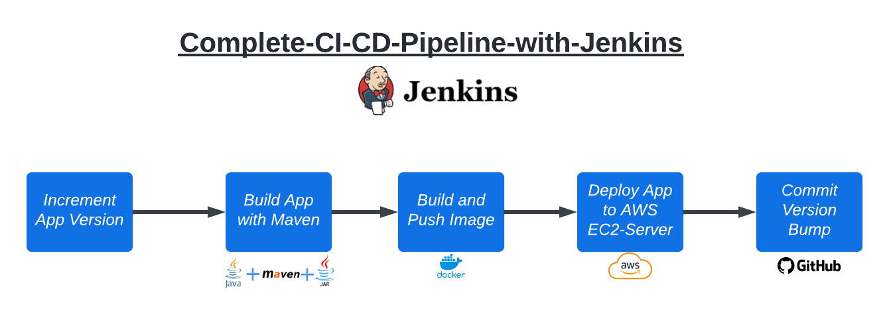

# Complete-CI-CD-Pipeline-with-Jenkins

A Scripted Multi-branch pipeline that is triggered automatically on code changes and which test and build the application ( Java Maven App ) into a docker image with automatically incremented version and push that image into configured docker repo 

                                                                    
