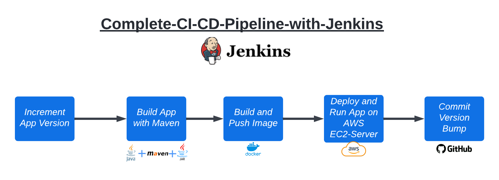
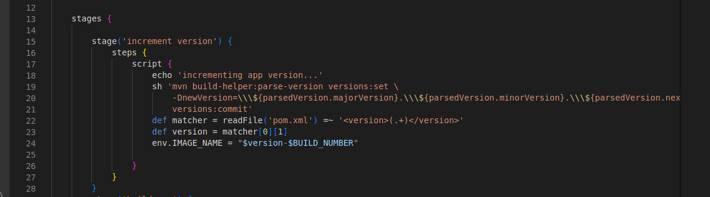
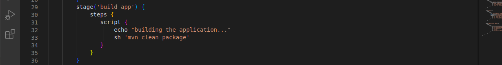
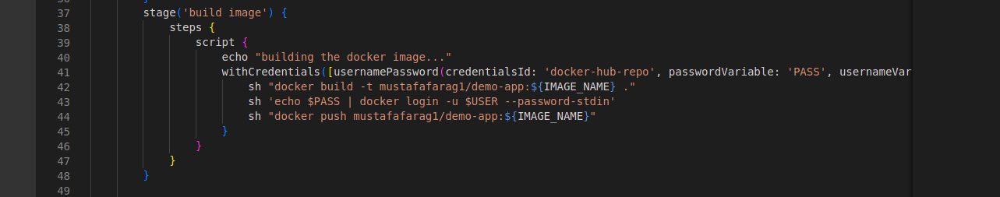
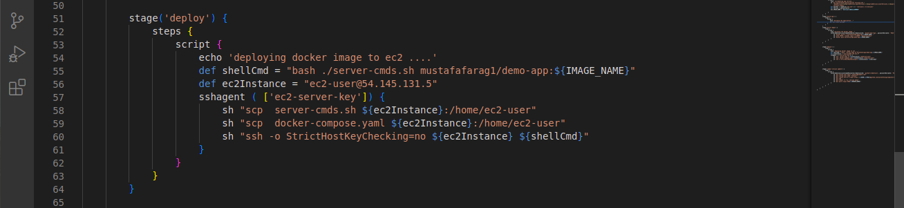
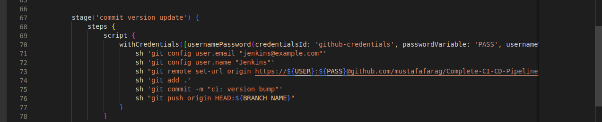

# Complete-CI-CD-Pipeline-with-Jenkins

A Scripted **Multi-branch pipeline** that is triggered Automatically on code changes (Using GitHub WebHooks)
Consists of 5 Stages :
1-Automatically Handle the versioning of the app (Increment app version number with each new build).
2-Building and Testing the App (Using Maven).
3-Building a Docker Image of the App and Login & and Push to DockerHub Repository.
4-Deploy App to an AWS-EC2 Instance.
5-Commit Version Update to App GitHub Repository.

## Stages Explained : 

**Stage One : Versioning my Application**

WHY ?
Scenario : Development team developed a new feature or a bug fix and those must be available to the end user and must release a new version of our application.

This Process must be Automated and keep tracked

- Each Build Tool/Package manager holds the version of the app itself in a file ( in my case   java maven for my app ) its called pom.xml

- We start by using a Maven Plugin command to read and increment the version numbers as we want 
- Read our pom.xml file and and abstract the new version number and save it in a variable called version 

- Finally we create  an environment variable  called env.IMAGE_NAME
And set it to the version-BULID_NUMBER

env.IMAGE_NAME  and   version-BUILD_NUMBER 
Will be explained in later stages 

---------------------------------------------------------------------------------------------------------------------------

**Stage Two : Build App WIth Maven**

 - Maven Building Tool is Configured in jenkins through Global Tool Configuration  
 - we run ‘maven clean package’  To clear any created jar files and start building the app with the new version number set 

-----------------------------------------------------------------------------------------------------------------------------------------------------------

**Stage Three : Build Image**

- Building a docker Image of our created jar file app and log in and push our created image to dockerhub container repistery 

-----------------------------------------------------------------------------------------------------------------------------------------------------------

**Stage Four : Deploy App**

- An Already AWS-EC2 Deployment-Server is created to host and run the  App 

- We access the the deployment server through SSH from jenkins and copy our docker-compose.yaml & server-cmds.sh  files from jenkins server to App host server (  AWS-EC2 Deployment-Server )

- Run server-cmds.sh and it triggers docker-compose file that ( Pulls Docker App image and run it as a container )

---------------------------------------------------------------------------------------------------------------------------

**Stage Five :  Commit Version Update** 

-By using GitHub Credentials configured in jenkins, We Logged in to github and dynamically update the version in pom.xml file in the working branch

-----------------------------------------------------------------------------------------------------------------------------------------------------------

Built With 

- [Amazon AWS EC2-Instance](https://aws.amazon.com/) Cloud services
- [Jenkins](https://www.jenkins.io/) (CI/CD) Automation software
- [Docker & docker-compose](https://www.docker.com/) Containerization Tool
- [DockerHub](https://hub.docker.com/) Container Registry
- [GitHub WebHooks](https://docs.github.com/en/developers/webhooks-and-events/webhooks/about-webhooks) User-defined HTTP callbacks
- [Maven](https://maven.apache.org/) Open-source build tool for Java
